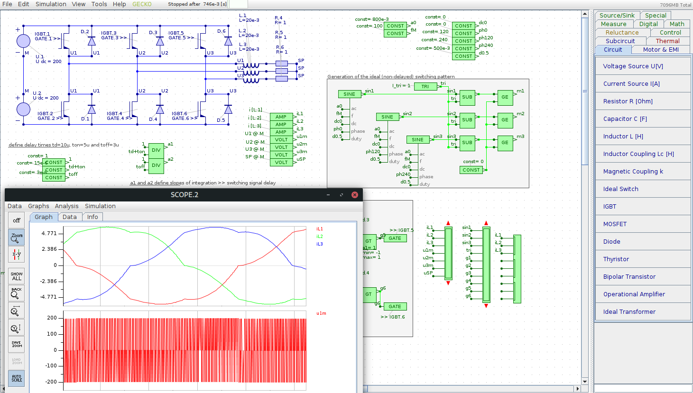
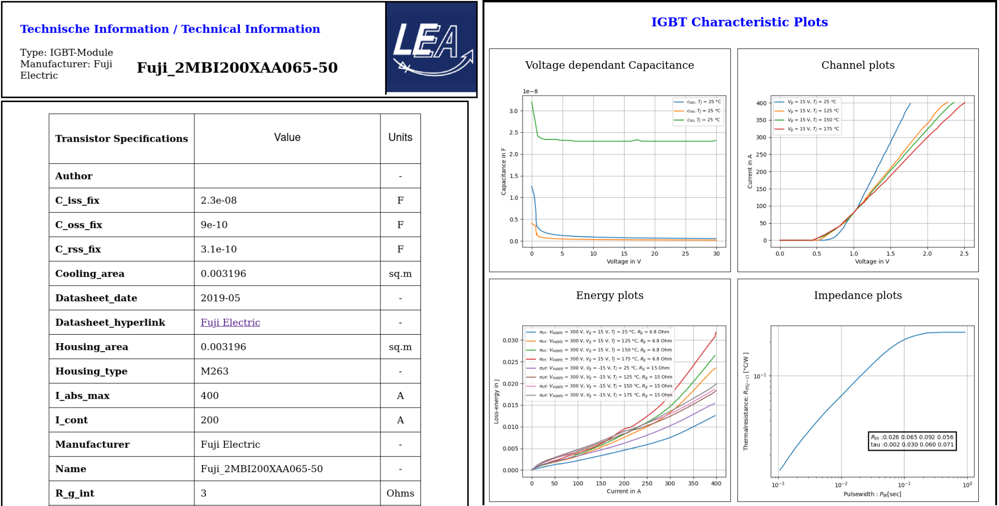
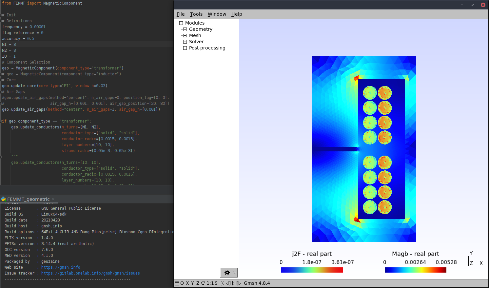
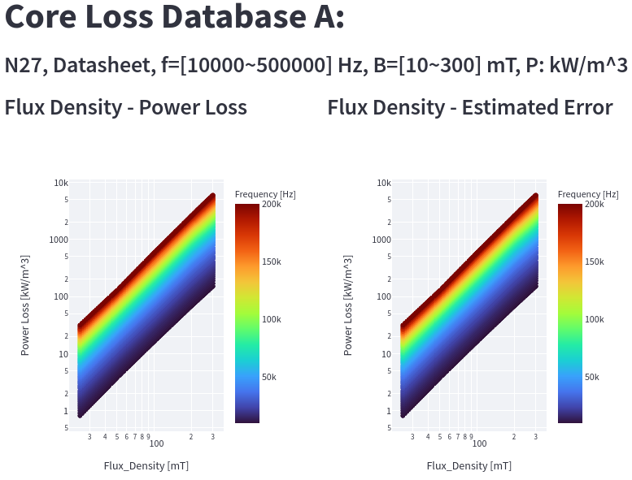

# Open-Source-Power-Electronic-Tools
Lists open source tools for power electronic engineers.

Missing Tool? -> Open an Issue or open a pull request.

## Table of Contents

- [Circuit Simulation and Calculation](#circuitsimulation)
- [Drawing and Documentation](#documentation)

## Circuit Simulation and Calculation

| Name | Description | Link | Images |
|------|-------------|------|--------|
| [GeckoCIRCUITS](https://github.com/geckocircuits/GeckoCIRCUITS) | GeckoCIRCUITS is a fast and easy-to-use circuit simulator optimized for power electronics. |  <ul><li><a href="https://de.wikipedia.org/wiki/GeckoCircuits">Wikipedia</a></li> <li> <a href="https://github.com/geckocircuits/GeckoCIRCUITS">GitHub</a></li> </ul> | |
| [transistordatabase](https://github.com/upb-lea/transistordatabase) | A unified software engineering tool for managing and evaluating power transistors |  <ul> <li> <a href="https://upb-lea.github.io/transistordatabase/main/index.html">Documentation</a></li> <li><a href="https://pypi.org/project/transistordatabase/">PyPI</a></li></ul> |  |

## Drawing and Documentation

| Name | Description | Link | Images|
|------|-------------|------|-------|
| [Inkscape Electric Symbols](https://github.com/upb-lea/Inkscape_electric_Symbols) | Electrical symbol library for the vector graphics program Inkscape. | [Readme](https://github.com/upb-lea/Inkscape_electric_Symbols#readme) ||

## Magnetics
| Name | Description | Link | Images|
|------|-------------|------|-------|
| [FEMMT](https://github.com/upb-lea/FEM_Magnetics_Toolbox) | Python toolbox to generate preconfigured structures for FEM simulation tools in power electronics |  <ul><li> <a href="https://github.com/upb-lea/FEM_Magnetics_Toolbox">GitHub</a></li> </ul> | |
| [Magnet](https://mag-net.princeton.edu/) | Data Driven Methods for Magnetic Core Loss Modeling |  <ul><li> <a href="https://github.com/PrincetonUniversity/Magnet">GitHub</a></li> </ul> | |
