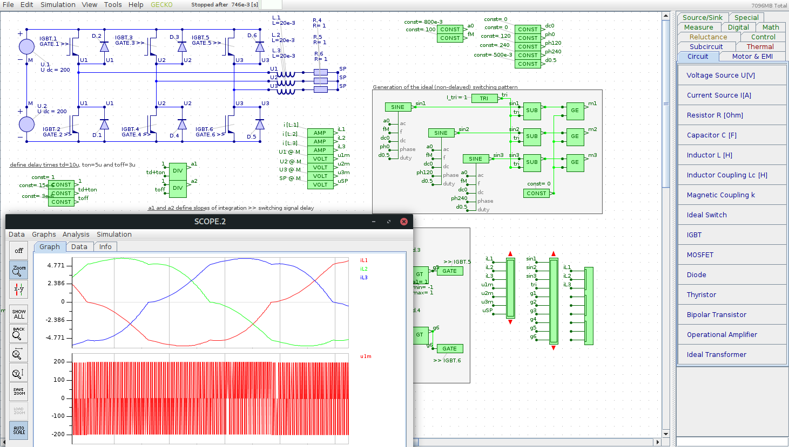
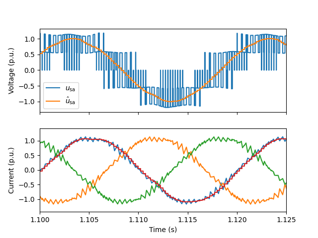
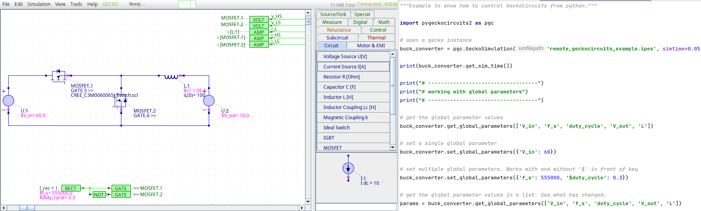
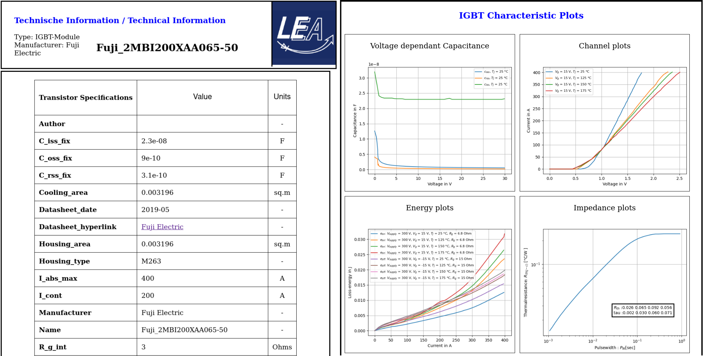
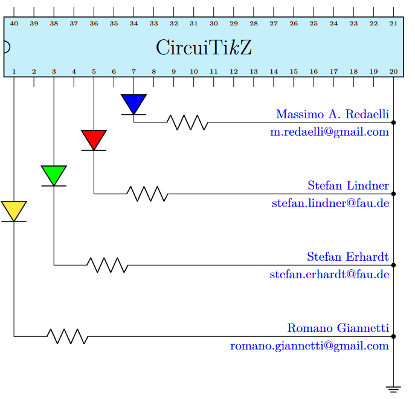
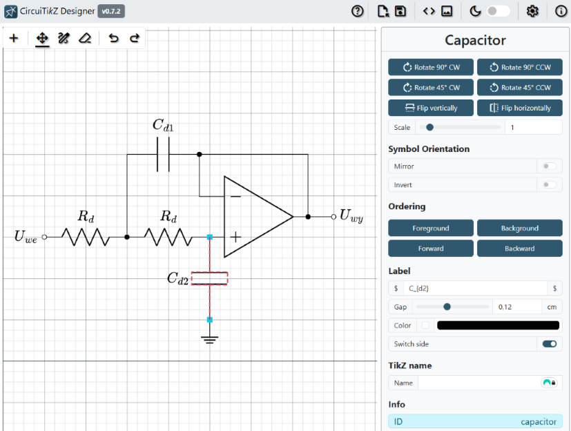
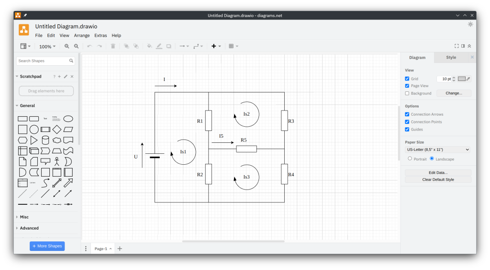

# Open-Source-Power-Electronic-Tools
Lists open source tools for power electronic engineers.

Missing Tool? -> Open an Issue or open a pull request.

## Table of Contents

- [Circuit Simulation and Calculation](#Circuit-Simulation-and-Calculation)
- [Drawing and Documentation](#drawing-and-documentation)
- [Magnetics](#magnetics)
- [Schematics and Layout](#schematics-and-layout)
- [Calculation and Automatisation](#Calculation-and-automatisation)
- [Control Platform](#control-platform)

## Circuit Simulation and Calculation

| Name | Description | Link | Screenshot |
|------|-------------|------|--------|
| [eSim](https://github.com/FOSSEE/eSim) | eSim is an open source EDA tool for circuit design, simulation, analysis and PCB design. |  <ul><li><a href="https://esim.fossee.in/home">Homepage</a></li> <li> <a href="https://github.com/FOSSEE/eSim">GitHub</a></li> </ul> | |
| [GeckoCIRCUITS](https://github.com/geckocircuits/GeckoCIRCUITS) | GeckoCIRCUITS is a fast and easy-to-use circuit simulator optimized for power electronics. |  <ul><li><a href="https://de.wikipedia.org/wiki/GeckoCircuits">Wikipedia</a></li> <li> <a href="https://github.com/geckocircuits/GeckoCIRCUITS">GitHub</a></li> </ul> | |
| [GSEIM](https://github.com/gseim/gseim) | GSEIM (General-purpose Simulator with Explicit and Implicit Methods) is meant for simulation of electrical circuits, especially power electronic circuits, and also for numerical solution of ordinary differential equations (ODEs). |  <ul><li><a href="https://gseim.github.io/build/html/index.html">Homepage</a></li> <li> <a href="https://github.com/gseim/gseim">GitHub</a></li> </ul> | |
| [motulator](https://github.com/Aalto-Electric-Drives/motulator) | motulator is an open-source motor drive simulator in Python. It contains models for induction machines, synchronous reluctance machines, and permanent-magnet synchronous machines as well as various control methods as examples. |  <ul> <li> <a href="https://aalto-electric-drives.github.io/motulator/">Documentation</a></li> <li><a href="https://aalto-electric-drives.github.io/motulator/auto_examples/index.html">Examples</a></li></ul> |  |
| [PyGeckoCircuits2](https://github.com/upb-lea/pygeckocircuits2) | A Python wrapper for GeckoCIRCUITS. |  <ul><li><a href="https://upb-lea.github.io/pygeckocircuits2/intro.html">Documentation</a></li> <li> <a href="https://github.com/upb-lea/pygeckocircuits2">GitHub</a></li> </ul> |  |
| [transistordatabase](https://github.com/upb-lea/transistordatabase) | A unified software engineering tool for managing and evaluating power transistors |  <ul> <li> <a href="https://upb-lea.github.io/transistordatabase/main/index.html">Documentation</a></li> <li><a href="https://pypi.org/project/transistordatabase/">PyPI</a></li></ul> |  |
| [Circuit Calcs](https://github.com/AJEngineering/circuit-calcs) | A single-file offline calculator collection for electronics, including power-converter, gate-drive, snubber and thermal design calculations. | <ul><li><a href="https://ajengineering.github.io/circuit-calcs/">Demo</a></li> <li><a href="https://github.com/AJEngineering/circuit-calcs">GitHub</a></li></ul> | |

## Drawing and Documentation

| Name | Description | Link | Screenshot |
|------|-------------|------|-------|
| [CircuiTikZ](https://github.com/circuitikz/circuitikz) | Set of macros on top of TikZ for typesetting electrical and electronic networks native to LaTeX | <ul> <li> <a href="https://github.com/circuitikz/circuitikz">GitHub</a></li> <li> <a href="https://ctan.org/pkg/circuitikz">CTAN</a></li> </ul> |  |
| [CircuiTikZ-Designer](https://github.com/Circuit2TikZ/CircuiTikZ-Designer) | A GUI for drawing CircuiTikZ circuits  | <ul> <li> <a href="https://github.com/Circuit2TikZ/CircuiTikZ-Designer">GitHub</a></li> <li> <a href="https://circuit2tikz.tf.fau.de/designer/">Website</a></li> </ul> |  |
| [CircuiTikZ for Inkscape](https://github.com/medwatt/circuitikz_symbols) | CircuiTikZ for Inkscape | <ul> <li> <a href="https://github.com/medwatt/circuitikz_symbols">GitHub</a></li> </ul> |  |
| [draw.io Desktop](https://github.com/jgraph/drawio-desktop) | Multiplatform diagramming and whiteboarding tool with electronics symbols | <ul> <li> <a href="https://github.com/jgraph/drawio-desktop">GitHub</a></li> <li> <a href="https://www.draw.io">Online-Version</a></li> </ul> |  |
| [draw.io Electrical Engineering](https://github.com/NicklasVraa/Draw-io-ECE/tree/master) | Drawing electrical engineering and computer-science related diagrams, such as circuits and control-architectures in draw.io. | <ul> <li> <a href="https://github.com/NicklasVraa/Draw-io-ECE/tree/master">GitHub</a></li> </ul> | |
